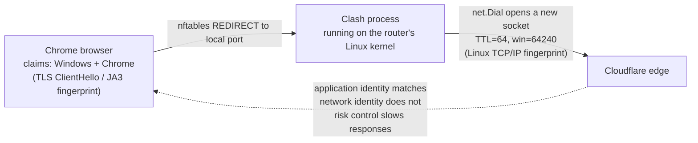
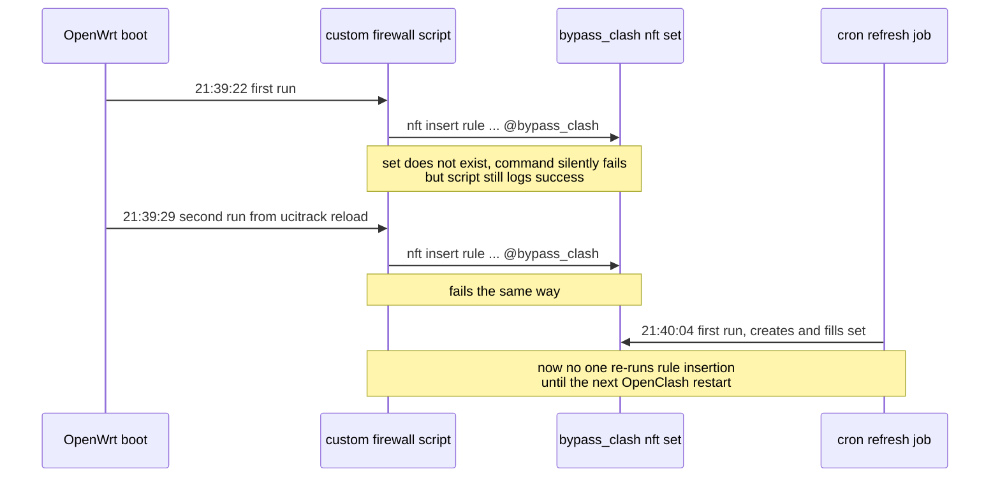

## How It Started

The symptom was simple: after enabling OpenClash, the ChatGPT web app became extremely slow. Dozens, sometimes hundreds, of requests would stall. Even a small static asset could take anywhere from a dozen seconds to more than a minute. But a few details were odd:

- I had not configured ChatGPT traffic to go through a proxy node; the rules clearly resolved it as DIRECT.
- It had nothing to do with QUIC; the browser was using normal HTTP/2.
- Disabling OpenClash made the same page load instantly, just like any normal website.
- I was not in mainland China, so the usual GFW explanation could be ruled out early.

When a connection is supposedly direct, yet disabling the proxy stack immediately fixes it, the cause is unlikely to be a simple rule mismatch. This post records the full investigation, from the early guesses to packet-capture proof, and finally to a race condition hidden in the way my OpenClash firewall customization was wired together.

## Round One: Eliminating the Usual Suspects

I started where most people would: with the common explanations.

**DNS pollution?** I tested `https://chatgpt.com` with `httpstat`. DNS resolution took only 17ms, TCP connect was 0ms because the connection was reused, TLS took 162ms, and the whole request completed in 242ms. The response was Cloudflare's 403 challenge page (`Cf-Mitigated: challenge`), which is normal for `curl` without a real browser fingerprint. It was not related to the slowdown, and it also proved that the network path itself was reachable and fast.

**conntrack table full?** On the router:

```
nf_conntrack_count: 392
nf_conntrack_max:   62976
```

That was nowhere near the limit, so conntrack was out.

**CPU bottleneck?** While the page was stalled, I watched the router with `top -d 1`:

```
CPU:   0% usr   0% sys   0% nic  99% idle   0% io   0% irq   0% sirq
```

The Clash process stayed at `0%CPU`. The CPU was almost completely idle while transfers were stuck. That was an important signal: **the problem was not insufficient compute power. Something was waiting or being held back; it was not actively calculating.**

## Round Two: Laying Out the HAR File

Since single-request tests like `httpstat` and `curl` were fast, while the real browser session was slow, the next step was to analyze the browser's own request timing from a HAR file. I captured a full Network panel trace and found:

- Out of 524 requests, **367 took more than 5 seconds**. The median total duration was **23.5 seconds**, and the slowest static asset, a 33KB image, took **76.7 seconds**.
- Almost all requests reused **the same HTTP/2 connection**, which meant there were only a few underlying TCP connections and the rest were HTTP/2 streams.
- DNS, TCP, and TLS were all fast: DNS median 1.7ms, TCP connect 66ms, TLS handshake 64ms. But the **wait time, or time to first byte, had a median of 19 seconds**, and this was consistent across both API calls and static files.

The most important clue was the 76.7-second static file. Its response headers said `cf-cache-status: HIT` and `age: 3448533`, meaning the object had been sitting in Cloudflare's edge cache for nearly 40 days. **A cached edge object that should have been returned in milliseconds took 76 seconds to reach me.** That pointed away from OpenAI backend capacity or server processing and toward the transfer path between Cloudflare's edge and my client.

At this point, DNS, TCP connection setup, and TLS handshake were all cleared. The bottleneck was narrowed down to **the period after the connection was established, while waiting for the response**.

## Round Three: Was It Really DIRECT?

The rule said DIRECT, but OpenClash in Redir-Host mode has an important property: all TCP traffic, whether it will eventually be direct or proxied, is first redirected into the Clash process through iptables or nftables. Clash then reads SNI or Host and decides what to do. In other words, even when the final decision is DIRECT, the outbound connection is initiated by the Clash process, not forwarded directly by the kernel in the original sense.

To confirm whether the rule decision was wrong, I queried the Clash management API:

```bash
curl -s -H "Authorization: Bearer <secret>" "http://192.168.123.1:9090/connections" \
  | python3 -c "
import json,sys
data = json.load(sys.stdin)
for c in data.get('connections', []):
    host = c.get('metadata', {}).get('host', '')
    if 'chatgpt.com' in host:
        print('chains:', c.get('chains'))
"
```

The result was `chains: ['DIRECT']`. So the rule was not sending ChatGPT through a proxy node.

If it was truly direct, why was it still slow? I ran another comparison: 20 parallel `curl` requests to the same URL. Every one finished in 0.3-0.5 seconds, with no stall at all. Plain concurrency did not reproduce the problem. The slowdown only appeared in a real browser session.

## Round Four: Trying a Different Interception Mode

Because Redir-Host does "intercept first, decide later," I suspected that mode might be the problem. So I switched to Fake-IP and tested again. **The result was the same: still slow.**

That result was useful. In Fake-IP mode, the client receives fake destination IPs, and only Clash knows which real domain each fake IP maps to. That means **100% of those connections must pass through the Clash process**. Redir-Host and Fake-IP are different interception modes, yet both produced the same slowdown. The common variable was not the interception mode. It was whether the final outbound connection was re-initiated by Clash itself.

## Breakthrough: Letting the Traffic Go Through Bare

If the suspect was "Clash re-dials the connection," the right comparison was to bypass Clash entirely at the firewall layer. I wanted ChatGPT's destination IP to skip Clash and become plain kernel NAT forwarding, exactly like when OpenClash was disabled.

On the router, I inspected the nftables rules. ImmortalWrt uses fw4/nftables by default, not traditional iptables:

```bash
nft list chain inet fw4 openclash
```

```
chain openclash {
    ip daddr @localnetwork counter packets 13 bytes 684 return
    ct direction reply counter packets 0 bytes 0 return
    ip protocol tcp ip daddr 198.18.0.0/16 counter packets 0 bytes 0 redirect to :7892
    ip protocol tcp counter packets 78 bytes 4056 redirect to :7892
}
```

The chain was very clean. There was no early domain or IP exclusion logic. The final rule redirected **all TCP traffic unconditionally into Clash**. That is essentially how Redir-Host works: the firewall cannot know in advance whether a connection should go through Clash, so it redirects the traffic first and lets Clash inspect SNI or Host.

I inserted a rule that made one resolved ChatGPT IP return before the final redirect:

```bash
nft insert rule inet fw4 openclash ip daddr 172.64.155.209 counter return
```

**Immediately after inserting the rule, the page became fast again, exactly like when OpenClash was disabled.**

## Hard Evidence: Comparing TCP Fingerprints

"It got faster" was strong, but I wanted harder proof that the Clash process itself was the variable. I captured SYN packets with `tcpdump` in two scenarios.

**Through Clash forwarding:**
```
ttl 64, win 64240, options [mss 1460, sackOK, TS val ..., nop, wscale 7]
```

**Bypassing Clash with the nft return rule:**
```
ttl 127, win 65535, options [mss 1460, nop, wscale 8, nop, nop, sackOK]
```

The difference was obvious:

| | Through Clash | Bypassing Clash |
|---|---|---|
| TTL | 64 | 127 |
| Window | 64240 | 65535 |
| Option order | mss, sackOK, TS, nop, wscale | mss, nop, wscale, nop, nop, sackOK |

**TTL 64 is the Linux default. TTL 127 corresponds to a Windows default of 128 after one router hop.** These SYN packets were generated by two different TCP/IP stacks. When traffic went through Clash, the outbound TCP connection was not initiated by my Windows machine. It was initiated by the Clash process running on the OpenWrt router, using Go's `net.Dial` and the router's Linux kernel. Clash forwards DIRECT traffic as bytes, so the TLS layer, including ClientHello and JA3, still looks like the real browser. But **the TCP/IP layer quietly changes to the Linux router's fingerprint**.

In other words, Cloudflare saw an application layer that claimed to be Chrome on Windows, while the network layer looked like Linux. That kind of mismatch is exactly the kind of signal Cloudflare Bot Management systems may care about. The path looked like this:



The TLS layer was still the browser's original bytes. But the TCP/IP handshake was generated anew by Clash on the router, so the fingerprint became Linux. The application identity and network identity no longer matched.

Most websites do not enforce this aggressively, but OpenAI is a heavy scraping target, so its Cloudflare rules are likely strict. That explains why the issue concentrated on ChatGPT while other HTTP/2 sites were fine. Cloudflare probably did not fully block the session, because the cookies and JavaScript challenge were real. Instead, it appeared to apply a "allow but slow down" response that discouraged suspicious automation. That matched all observations: connection setup was fast, transfer was slow, cached assets were also slow, and the issue was specific to ChatGPT.

## Making the Workaround Persistent

After confirming the mechanism, I needed to turn the temporary nft rule into a stable setup:

1. Create an independent nftables named set called `bypass_clash`, so more domains could be added later without creating a separate set for each site.
2. Write a script that periodically resolves domains like chatgpt.com and fills the set with the resulting IPs.
3. In OpenClash's developer option for custom firewall rules, insert two `return` rules referencing this set, so matching traffic exits before the final REDIRECT.
4. Run the refresh script from cron to handle CDN IP rotation.

OpenClash already has a similar mechanism for bypassing mainland China IPs. It also inserts `return` rules into `openclash` and `openclash_mangle` that reference an IP set. The principle is the same. I used a separate set because this was not specifically about China IP ranges.

## The Trap: Rules Disappeared After Router Reboot

The setup worked manually. But after rebooting OpenWrt, the custom firewall rule disappeared. Running `/etc/init.d/openclash restart` by hand always worked. That difference between "service restart" and "full boot" forced me to read through OpenClash's init script.

OpenClash registers an fw4 include hook at `/var/etc/openclash.include`, and the file contains just one line:

```bash
/etc/init.d/openclash reload "firewall"
```

So whenever the system firewall is regenerated, such as when WAN gets DHCP later and triggers an ifup event, it calls back into OpenClash's `reload_service "firewall"` branch. That branch does this:

```bash
revert_firewall      # synchronous: immediately deletes and recreates OpenClash chains/sets
do_run_mode           # synchronous, but mostly variable handling
check_core_status &   # note the &: this runs in the background
```

The step that eventually re-inserts custom firewall rules is inside `set_firewall()`, called near the end of `check_core_status`. But that whole path is pushed into the background. The main process returns without waiting for it. That creates a window where rules have been cleared, but rebuilding has not finished yet.

I then captured logs from a real boot and found that OpenClash almost always triggered two firewall reloads during startup. This was probably because startup commits firewall UCI config to register its include hook, and OpenWrt's `ucitrack` reacts to that commit with another reload. Surprisingly, both attempts to run the custom script reported success, but the final rule was still missing. That did not fully match my first "background race" theory. There was another problem.

## The Real Root Cause: A Chicken-and-Egg Problem

Comparing the timeline revealed the real issue:



The `bypass_clash` nftables set was created by the cron script. But cron only runs after the first full minute boundary after boot. That means when the custom firewall script tried to insert rules, the set did not exist yet. A command like `nft insert rule ... ip daddr @bypass_clash ...` fails if the set is missing. But the script did not check the return value and printed a success log anyway. By the time cron finally created the set, no one was left to insert the rules. The next OpenClash restart would retry the same sequence, and boot would hit the same ordering issue again.

This was my own design bug: two independent components, one creating the set and one inserting rules that reference the set, had no contract about ordering.

## The Final Fix

The fix was direct: do not rely on cron to create the set first. The custom firewall script should ensure the set exists before inserting rules. An empty set is fine; nftables can reference it, and when cron later fills it with IPs, the already-inserted rules start matching automatically.

```bash
#!/bin/sh
. /usr/share/openclash/log.sh
. /lib/functions.sh

LOG_TIP "Start Add Custom Firewall Rules..."

# Key fix: ensure the set exists before referencing it.
nft list set inet fw4 bypass_clash >/dev/null 2>&1 || \
  nft add set inet fw4 bypass_clash '{ type ipv4_addr; flags interval; }'

# Avoid duplicate insertions.
if ! nft list chain inet fw4 openclash 2>/dev/null | grep -q '@bypass_clash'; then
  nft insert rule inet fw4 openclash ip daddr @bypass_clash counter return
fi
if ! nft list chain inet fw4 openclash_mangle 2>/dev/null | grep -q '@bypass_clash'; then
  nft insert rule inet fw4 openclash_mangle ip daddr @bypass_clash counter return
fi

logger -t bypass_clash "custom firewall rules added"
exit 0
```

After rebooting the router and testing again, ChatGPT loaded normally. The problem was fixed.

## Full Debugging Chain

Looking back, the chain was:

1. Symptom: ChatGPT became extremely slow with OpenClash enabled, and normal when OpenClash was disabled.
2. DNS, conntrack, and CPU were ruled out.
3. HAR analysis showed the bottleneck was in response wait time, not connection setup, and even cached edge files were slow.
4. The Clash API confirmed the rule result was DIRECT, not a proxy node.
5. Redir-Host and Fake-IP both reproduced the issue, so the interception mode was not the root cause.
6. An nft return rule that bypassed Clash made the problem disappear, pointing to Clash's own forwarding path.
7. TCP packet captures proved that Clash forwarding changed the TCP/IP fingerprint to Linux while the application layer still looked like Windows Chrome, likely triggering Cloudflare risk controls.
8. I built a persistent workaround with an nft set, custom firewall rules, and cron.
9. After reboot, rules disappeared. Reading OpenClash's source revealed asynchronous firewall reload behavior.
10. The deeper root cause was actually my own ordering bug: rules referenced a set before the set existed.
11. Fix: make the custom firewall script create the set before inserting rules.

The interesting part is how many plausible explanations were wrong: DNS, CPU, conntrack, GFW, node selection, ipset ordering, and so on. Two steps were decisive: breaking down HAR timing into wait time versus connection setup, and comparing TCP fingerprints with `tcpdump`. Without those, this issue would have been very hard to pin down.

---

## Afterword: What Happens After Returning to China?

This bypass works by making traffic avoid Clash entirely, so it only applies when that traffic should be direct in the first place. If ChatGPT needs to go through a proxy node after returning to China, this exact workaround no longer applies. Proxy-node traffic must go through Clash, because Clash is the component that connects to the node and relays the data.

It is worth being precise about where Cloudflare sees the fingerprint. Cloudflare only sees packets from the machine that directly establishes the TCP connection to it. TCP/IP does not preserve "which machines this packet passed through" across hops. Each hop is a separate connection. So fingerprinting happens at the final hop, the machine that directly connects to Cloudflare.

Scenario 1 is the one proven in this post: the Clash process on the local router connects directly to Cloudflare, so Cloudflare sees the Linux router's fingerprint, which does not match the Windows browser identity. In scenarios 2 and 3, the machine that connects to Cloudflare is the remote proxy server. That final hop is unrelated to the local router or local Clash process. Based on this logic, those scenarios should not trigger this specific local fingerprint mismatch.

But there is an important correction: **ruling out this one fingerprint mismatch does not mean there will be no throttling.** Throttling can be triggered by more than one signal. I only verified one of them, and that does not prove proxy-node traffic has no other risk signal. In practice:

- **Scenario 2, OpenClash plus proxy node:** even while abroad, simply switching the rule from direct to a proxy node still made ChatGPT slow.
- **Scenario 3, browser-level proxy with Chrome + SwitchyOmega + v2rayN:** in my test, it was not slow.

For scenario 2, the likely explanations move from the local router to the remote node. Many public node IPs are shared by unrelated users, producing traffic patterns that look bot-like and causing poor IP reputation. The node server itself may also use a forwarding stack that creates its own mismatch between browser identity and transport fingerprint. Or the trigger may be something else entirely, such as request pattern or rate-based risk controls. I did not packet-capture that path, so these remain hypotheses.

The precise conclusion is: **this post fully verifies one cause: local router Clash forwarding changes the TCP/IP fingerprint and can trigger throttling in direct mode. Whether proxy-node mode is slow for the same reason has not been verified.** The one confirmed workaround is to avoid the local transparent proxy layer and use a browser-level proxy instead, as in scenario 3.

If I later get a chance to capture scenario 2 and compare TCP fingerprints, I may update this section.
