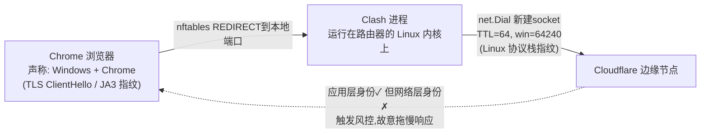
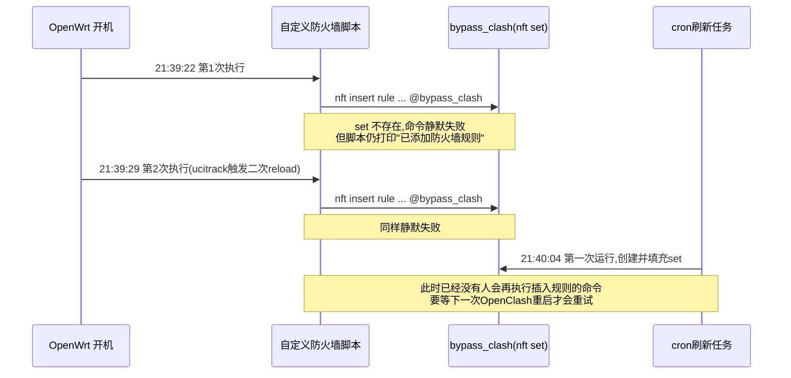
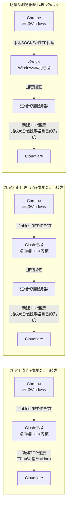

# 排查 OpenClash 把 ChatGPT 拖慢到不能用的全过程：从 DNS 到 TCP 指纹的一次硬核 debug

## 起因

事情的开头很简单：用了 OpenClash 之后，ChatGPT 网页变得特别慢。具体表现是页面上几十个、几百个请求几乎全部卡住，随便一个静态资源都要等十几秒到一分多钟。但奇怪的是：

- 我并没有把 ChatGPT 设置成走代理节点，规则上确认是 DIRECT（直连）；
- 跟 QUIC 没关系，浏览器走的是标准的 HTTP/2；
- 关掉 OpenClash，同样的页面瞬间打开，跟正常网站没有区别；
- 我不在国内，可以先排除 GFW 干扰这个最常见的"嫌疑人"。

一个"明明配置成直连，关掉代理软件却立刻变快"的现象，注定不会是简单的规则配置错误。这篇文章记录了完整的排查过程——从最初的瞎猜，到抓包实锤，再到最后在 OpenClash 自己的脚本逻辑里挖出一个隐藏的竟态 bug。

## 第一轮排查：把常见嫌疑人一个个排除

刚开始我跟大多数人一样，先从最常见的几个方向猜起：

**DNS 污染？** 用 `httpstat` 单独测了一次 `https://chatgpt.com`，DNS 解析只要 17ms，TCP 连接 0ms（连接复用），SSL 握手 162ms，整个请求 242ms 完成——但返回的是 Cloudflare 的 403 挑战页（`Cf-Mitigated: challenge`）。这是 `curl` 没有真实浏览器指纹导致的正常拦截，跟卡顿无关，但也说明网络层本身是通的、而且很快。

**conntrack 表爆满？** 路由器上查：

```
nf_conntrack_count: 392
nf_conntrack_max:   62976
```

差了两个数量级，完全没压力，排除。

**CPU 算力不够？** 在页面卡顿的同一时刻，路由器上跑 `top -d 1` 盯着：

```
CPU:   0% usr   0% sys   0% nic  99% idle   0% io   0% irq   0% sirq
```

Clash 进程 `%CPU` 全程 0%。CPU 几乎完全空闲，但传输却卡死——这其实是一个很重要的信号：**问题不是算力跟不上，而是某个环节在主动等待/阻塞，根本没有真正在计算。**

## 第二轮：把 HAR 文件摊开来看

既然单点测试（`httpstat`、`curl`）都很快，真正的卡顿只在浏览器真实加载页面时出现，那就得分析浏览器自己记录的请求时序（HAR 文件）。抓了一份完整的 Network 面板记录分析：

- 524 个请求里，**367 个超过 5 秒**，总耗时中位数 **23.5 秒**，最慢的一个静态资源（33KB 的图片）用了 **76.7 秒**；
- 几乎所有请求都复用了**同一条 HTTP/2 连接**（说明只建立了极少数底层 TCP 连接，剩下全靠多路复用的 stream 在跑）；
- 各阶段耗时拆开看：DNS 中位数 1.7ms，TCP 连接 66ms，TLS 握手 64ms——全部很快；但 **wait（等首字节）阶段中位数高达 19 秒**，且不管请求的是动态接口还是静态文件，这个等待时间几乎一致。

最关键的一条证据：那个耗时 76.7 秒的静态文件，响应头里写着 `cf-cache-status: HIT`，`age: 3448533`（这个对象已经在 Cloudflare 边缘缓存里放了快 40 天）。**一个命中边缘缓存、本该几毫秒内吐出来的文件，花了 76 秒才送到本地。** 这说明数据早就在 Cloudflare 边缘准备好了，问题出在"边缘到我这边"的传输过程本身，跟 OpenAI 后端算力、跟服务器处理速度毫无关系。

到这一步，DNS、建连、TLS 握手全部洗清嫌疑，真正的瓶颈被锁定在：**连接建立之后，单个请求等待响应的这段时间**。

## 第三轮：到底是不是真的走了直连？

虽然规则上写的是 DIRECT，但 OpenClash 的 Redir-Host 模式有个特点：所有 TCP 流量（不管最终判定是直连还是代理）都会先被 iptables/nftables REDIRECT 进 Clash 进程，由 Clash 自己读取 SNI/Host 之后再做判断——也就是说，哪怕判定结果是 DIRECT，这条连接的"对外发起者"也是 Clash 进程自己，不是真正意义上的内核直通。

为了确认这一点到底有没有走错路，直接查询了 Clash 自带的管理 API：

```bash
curl -s -H "Authorization: Bearer <secret>" "http://192.168.123.1:9090/connections" \
  | python3 -c "
import json,sys
data = json.load(sys.stdin)
for c in data.get('connections', []):
    host = c.get('metadata', {}).get('host', '')
    if 'chatgpt.com' in host:
        print('chains:', c.get('chains'))
"
```

结果是 `chains: ['DIRECT']`——确认真的是直连，排除了"规则配置错了、其实走了代理节点"这个方向。

那既然真的是直连，为什么还会被卡？ 这时候做了一个很关键的对照实验：用 `curl` 连续发 20 个并发请求到同一个 URL，结果**全部在 0.3-0.5 秒内完成，毫无卡顿**。也就是说，单纯的"并发量大"也复现不出这个问题——卡顿只在**真实浏览器会话**里出现，curl 模拟不出来。

## 第四轮：换种拦截模式，结果一样

既然怀疑跟 Redir-Host 这种"先嗅探再判断"的模式有关，干脆换成 Fake-IP 模式测一次——**结果同样卡顿**。

这个结果反而是非常有价值的证据。Fake-IP 模式下，客户端拿到的目标 IP 本身就是假的，只有 Clash 自己知道这个假 IP 对应哪个真实域名，所以这种模式下 **100% 的连接都必须经过 Clash 进程**，根本不存在绕开的可能。Redir-Host 和 Fake-IP 两种完全不同的拦截方式，得到了完全一样的卡顿结果——这说明问题跟"用哪种模式拦截流量"毫无关系，**唯一的共同变量，就是这条连接最终是不是由 Clash 进程自己重新发起的。**

## 突破口：手动让流量"裸"过去

既然怀疑是"Clash 进程自己拨号"这一步本身导致的，那就该做真正的对照实验——在防火墙层面，让 ChatGPT 的目标 IP 完全跳过 Clash，变成纯粹的内核态 NAT 转发，跟关掉 OpenClash 时一模一样。

查看路由器的 nftables 规则(ImmortalWrt 默认是 fw4/nftables，不是传统 iptables)：

```bash
nft list chain inet fw4 openclash
```

```
chain openclash {
    ip daddr @localnetwork counter packets 13 bytes 684 return
    ct direction reply counter packets 0 bytes 0 return
    ip protocol tcp ip daddr 198.18.0.0/16 counter packets 0 bytes 0 redirect to :7892
    ip protocol tcp counter packets 78 bytes 4056 redirect to :7892
}
```

这条链非常干净——没有任何按域名或 IP 的预先排除逻辑，最后一条直接把**所有 TCP 流量无条件 REDIRECT 进 Clash**。这其实是 Redir-Host 模式的本质决定的：防火墙层面根本没法提前知道"这条连接该不该走 Clash"，必须先把流量接进 Clash 才能读到 SNI/Host 做判断。

于是手动插入一条规则，让 ChatGPT 解析出来的 IP 提前 `return`，跳过最后的 REDIRECT:

```bash
nft insert rule inet fw4 openclash ip daddr 172.64.155.209 counter return
```

**插完之后立刻测试，页面瞬间恢复正常速度，跟关掉 OpenClash 完全一样快。**

## 实锤证据：抓包对比 TCP 指纹

光是"变快了"还不能 100% 证明是 Clash 进程本身的问题，需要更硬的证据。用 `tcpdump` 分别抓了两种场景下，到 Cloudflare 服务器的 SYN 包：

**走 Clash 转发：**
```
ttl 64, win 64240, options [mss 1460, sackOK, TS val ..., nop, wscale 7]
```

**绕开 Clash(刚才那条 nft return 规则生效后)：**
```
ttl 127, win 65535, options [mss 1460, nop, wscale 8, nop, nop, sackOK]
```

两份对比放在一起，差异非常清晰：

| | 走 Clash 转发 | 绕开 Clash |
|---|---|---|
| TTL | 64 | 127 |
| Window | 64240 | 65535 |
| 选项顺序 | mss, sackOK, TS, nop, wscale | mss, nop, wscale, nop, nop, sackOK |

**TTL 64 是 Linux 默认值，TTL 127 则对应 Windows 默认值 128 经过路由器一跳之后的结果。** 这两个包是完全不同的两套 TCP/IP 协议栈实现生成的——铁证。当流量走 Clash 转发时，真正发起这条 TCP 连接的不是我的 Windows 电脑，而是路由器上 Clash 进程(用 Go 的 `net.Dial` 在 OpenWrt 这台 Linux 机器上新开的 socket)。Clash 对 DIRECT 流量做的是纯字节转发，TLS 层(ClientHello、JA3 指纹)是原样转发的，跟真实浏览器一致，但 **TCP/IP 层的指纹却悄悄变成了 Linux 路由器的特征**。

也就是说，到达 Cloudflare 那边的连接，应用层自称"Windows 上的 Chrome"，网络层却暴露出"这是个 Linux 主机"——这种不一致，正是像 Cloudflare Bot Management 这类反爬系统重点检测的信号之一。整条链路画出来是这样：



TLS 层(ClientHello、JA3 指纹)是 Clash 原样转发的字节，跟真实浏览器完全一致；但 TCP/IP 层的握手包是 Clash 进程在路由器上**重新生成**的，指纹变成了 Linux 路由器的特征。应用层身份和网络层身份对不上，正是问题所在。

大部分网站的反爬规则没这么激进，但 OpenAI 作为被疯狂爬取的对象，大概率把检测调得很严，所以这个问题只在 ChatGPT 上集中爆发，其他用 HTTP/2 的网站完全不受影响。Cloudflare 大概率不是直接拒绝(因为应用层的 cookie、JS 挑战都是真实通过的)，而是用一种"放行但故意拖慢"的软处理来劝退疑似自动化的流量——这跟前面观察到的所有现象(建连快、传输巨慢、缓存命中依然慢、只针对 ChatGPT)完全吻合。

## 做成持久化方案

确认原理之后，接下来要把"手动插一条临时规则"变成长期稳定生效的方案。思路是：

1. 建一个独立的 nftables 命名集合(named set)，取了个通用的名字 `bypass_clash`(方便以后把其他类似站点也加进来，不用每个站点单独建一个 set)；
2. 写一个脚本，定时解析需要绕过的域名(chatgpt.com 等)，把得到的 IP 灌进这个 set；
3. 在 OpenClash 的"开发者选项-自定义防火墙规则"入口里，插入两条引用这个 set 的 `return` 规则，让流量在到达最终的 REDIRECT 之前就被放行；
4. 用 cron 定时跑刷新脚本，应对 Cloudflare 这类 CDN 的 IP 轮换。

OpenClash 其实自带一套类似机制(用来"绕过中国大陆 IP"，同样是靠在 `openclash` / `openclash_mangle` 链里插入引用某个 IP 集合的 `return` 规则实现的)，原理完全一样，只是我们自己建了一个独立的 set，没有去复用官方那个只服务于"大陆 IP"场景的集合。

## 踩坑：重启路由器之后，规则又消失了

方案部署完，手动测试一切正常。但重启一次 OpenWrt 之后，自定义防火墙规则却不见了——而手动执行 `/etc/init.d/openclash restart` 却始终正常。这个"重启服务正常、重启整机异常"的差异，逼着去翻了一遍 OpenClash 的 init 脚本源码。

翻源码发现，OpenClash 注册给 fw4 的 include 钩子(`/var/etc/openclash.include`)只有一行：

```bash
/etc/init.d/openclash reload "firewall"
```

也就是说，任何时候系统级的防火墙重新生成一遍规则(比如 WAN 口比较晚才拿到 DHCP 地址、触发了一次 ifup 事件)，都会反过来触发 OpenClash 自己的 `reload_service "firewall"` 分支。这个分支里：

```bash
revert_firewall      # 同步执行,立刻把所有 openclash 链/set 全部删掉重建
do_run_mode           # 同步,但只是处理几个变量
check_core_status &   # 注意这个 & ,丢进后台异步执行!
```

真正负责重新插入自定义规则的那一步，藏在 `check_core_status` 函数最后调用的 `set_firewall()` 里——而这一整段是被丢进**后台异步执行**的，主流程不会等它跑完就直接返回了。这意味着存在一个时间窗口：规则已经被清空，但重建(包括重新插入自定义规则)还没真正跑完。

实际抓了一次真实重启时的日志，发现 OpenClash 在开机过程中**几乎必然会触发两次** firewall reload(大概率是因为启动时会 `uci commit firewall` 重新注册一次自己的 include 钩子，而 OpenWrt 的 `ucitrack` 机制专门监听这类配置变化，一提交就自动再触发一次 reload)。但意外的是，这两次重新执行自定义脚本居然都"显示成功"了——可规则最终还是不在。这跟最初猜测的"异步窗口期没跑完"不完全对得上，说明还有别的坑。

## 真正的根因：鸡生蛋，蛋生鸡

仔细比对时间线才发现问题所在：



`bypass_clash` 这个 nftables set，本来就是靠 cron 脚本创建的——而 cron 第一次真正执行，要等到开机后第一个完整的分钟边界才会触发。也就是说，**自定义防火墙脚本两次尝试插入规则的时候，它引用的那个 set 压根还不存在**。`nft insert rule ... ip daddr @bypass_clash ...` 这条命令引用一个不存在的 set，执行会直接失败——但脚本里这条命令的返回值根本没人检查，紧接着无条件打了一句"已添加防火墙规则"的成功日志，纯属脚本自己骗自己。等 cron 终于把 set 建出来时，已经没有人会再去执行那条插入规则的命令了，要等到下一次 OpenClash 重启才会再跑一遍——而下一次重启，同样的时序问题会再发生一遍。

这是我们自己埋的坑：两个独立组件(负责创建 set 的 cron 脚本，和负责插入规则引用这个 set 的 OpenClash 自定义脚本)之间没有约定好谁先准备好，导致规则插入永远抢跑在 set 创建之前。

## 最终修复

修复思路很直接：不依赖 cron 抢跑去创建 set，而是让自定义防火墙脚本**自己保证 set 一定存在**(哪怕第一次是空的也没关系，nftables 允许引用一个空 set，等 cron 后续把 IP 填进去，已经插好的规则会自动开始生效，不需要重新插入)：

```bash
#!/bin/sh
. /usr/share/openclash/log.sh
. /lib/functions.sh

LOG_TIP "Start Add Custom Firewall Rules..."

# 关键修复：先确保 set 一定存在，避免引用一个还不存在的 set 导致插入静默失败
nft list set inet fw4 bypass_clash >/dev/null 2>&1 || \
  nft add set inet fw4 bypass_clash '{ type ipv4_addr; flags interval; }'

# 顺手避免重复插入
if ! nft list chain inet fw4 openclash 2>/dev/null | grep -q '@bypass_clash'; then
  nft insert rule inet fw4 openclash ip daddr @bypass_clash counter return
fi
if ! nft list chain inet fw4 openclash_mangle 2>/dev/null | grep -q '@bypass_clash'; then
  nft insert rule inet fw4 openclash_mangle ip daddr @bypass_clash counter return
fi

logger -t bypass_clash "已添加防火墙规则"
exit 0
```

重启路由器，稳定运行之后再测，ChatGPT 加载速度恢复正常，问题彻底解决。

## 完整排查链路回顾

把整个过程串起来看：

1. 现象：开 OpenClash 之后 ChatGPT 巨慢，关掉就正常
2. 排除 DNS、conntrack、CPU 算力——全部正常，问题不在资源层面
3. HAR 分析锁定瓶颈在"请求等待响应"阶段，跟建连无关，缓存命中的文件也一样慢
4. Clash API 确认确实走的是 DIRECT，不是误判成了代理节点
5. Redir-Host 和 Fake-IP 两种模式结果一致，说明跟拦截方式无关
6. 手动 nft 规则让流量绕开 Clash，问题立刻消失——锁定是"Clash 进程自己转发"这一步本身
7. 抓包对比 TTL/窗口/选项，实锤是 Clash 转发导致 TCP 指纹变成了 Linux 特征，跟应用层的 Windows/Chrome 身份不一致，触发了 Cloudflare 的风控
8. 做持久化方案(nft set + 自定义防火墙规则 + cron)
9. 重启后规则消失，翻源码定位到 OpenClash 自身在防火墙重载时存在异步竟态
10. 进一步发现真正根因其实是我们自己方案里 set 创建和规则插入之间的时序问题
11. 修复：脚本自己保证 set 先于规则插入存在

整件事最有意思的地方在于，几乎每往前走一步，都先冒出一个看起来很有道理、最后却被实测推翻的假设——DNS、CPU、conntrack、GFW、节点选择、ipset 顺序……一个个排除下来才摸到真正的根因。回头看，真正决定性的两步，一个是用 HAR 把"等待时间"和"建连时间"拆开看，另一个是用 `tcpdump` 直接对比两种场景下的 TCP 指纹——光靠猜测和读文档，这个问题大概是永远定位不到的。

---

## 后记：回国之后怎么办？

这套绕开 Clash 进程的方案，本质是让流量完全不经过 Clash，所以前提是这部分流量本来就该走**直连**。回国之后如果 ChatGPT 需要改成走代理节点访问，这套方案天然用不上了——走代理节点这件事本身必须经过 Clash 进程(节点是 Clash 帮你连上去的，数据要先到 Clash、再从 Clash 转发到代理服务器，这一步没法跳过)。

这里有必要先把"Cloudflare 到底在哪一步看到指纹"这件事说清楚，不然容易得出错误的推论。Cloudflare 的服务器只能看到**直接跟它握手的那一方**发过来的包——TCP/IP 这一层不会传递"这个包之前经过了哪些中间节点"的信息，每一跳都是独立的连接。也就是说，指纹采集发生在"最后一跳"，即直接与 Cloudflare 建立 TCP 连接的那台机器。

三种场景下，"最后一跳"分别是谁，一图就能看清楚：



场景 1 就是文章正文实锤验证过的情况：本地路由器上的 Clash 进程直接和 Cloudflare 握手，指纹是 Linux 路由器的，跟应用层声称的 Windows 不一致。场景 2 和场景 3 里，真正和 Cloudflare 握手的都是远端代理服务器，这一步跟本地路由器、跟 Clash 完全没关系——按这个逻辑推，这两种场景理应都不会触发"本地指纹不一致"这个特定问题。

但这里需要纠正一处推理：**排除了"指纹不一致"这一个诱因，并不等于"不会被限速"**。限速可能由不止一种原因触发，我们只验证了其中一种，并不能反过来证明走代理节点时不存在别的诱因。实测下来，情况确实如此：

- **场景 2(OpenClash + 代理节点)**：即便在国外，单纯把规则从直连改成走代理节点，访问 ChatGPT 依然很卡。
- **场景 3(浏览器层代理，Chrome + SwitchyOmega + v2rayN)**：实测不卡。

场景 2 卡顿，合理的解释方向反而很直接，只是限速诱因发生的位置从本地路由器换到了远端节点：不少公开节点的服务器 IP 被海量互不相关的用户共用，访问模式天然偏"机器人化"，IP 信誉本身就容易被 Cloudflare 判定为可疑；也有可能节点服务器本身也是用类似的转发机制把流量代为发出的，同样会出现"声称的浏览器身份跟实际握手的协议栈不一致"，只是这次发生在远端节点而非本地路由器；也可能完全是另一类基于请求频率/流量模式的限速，跟 TCP 指纹无关。这几种可能我都没有抓包验证过，所以只能列出来，不下定论。

准确的结论应该是：**本文完整验证、并且实锤坐实的，只是"本地路由器上 Clash 转发导致 TCP 指纹不一致"这一种诱因。它在直连场景下会触发限速，这点证据链完整。走代理节点时是否会卡、卡顿的原因是否同类，目前没有验证过，不能下结论。** 唯一可以确定的是：绕开本地路由器的透明代理层，换成浏览器层直接代理(场景 3)，实测是有效的。

如果以后有机会对场景 2 也抓包比对一次 TCP 指纹，会再更新这部分内容。
